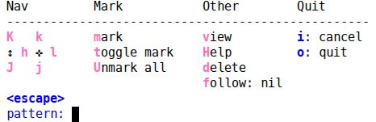

# VIM like browsing/action during Helm sessions

This hydra let you run certain helm actions to navigate and run actions on the items during a helm
session.

```cl
(defhydra helm-like-unite (:hint nil
                           :color pink)
  "
Nav ^^^^^^^^^        Mark ^^          Other ^^       Quit
^^^^^^^^^^------------^^----------------^^----------------------
_K_ ^ ^ _k_ ^ ^     _m_ark           _v_iew         _i_: cancel
^↕^ _h_ ^✜^ _l_     _t_oggle mark    _H_elp         _o_: quit
_J_ ^ ^ _j_ ^ ^     _U_nmark all     _d_elete
^^^^^^^^^^                           _f_ollow: %(helm-attr 'follow)
"
  ;; arrows
  ("h" helm-beginning-of-buffer)
  ("j" helm-next-line)
  ("k" helm-previous-line)
  ("l" helm-end-of-buffer)
  ;; beginning/end
  ("g" helm-beginning-of-buffer)
  ("G" helm-end-of-buffer)
  ;; scroll
  ("K" helm-scroll-other-window-down)
  ("J" helm-scroll-other-window)
  ;; mark
  ("m" helm-toggle-visible-mark)
  ("t" helm-toggle-all-marks)
  ("U" helm-unmark-all)
  ;; exit
  ("<escape>" keyboard-escape-quit "" :exit t)
  ("o" keyboard-escape-quit :exit t)
  ("i" nil)
  ;; sources
  ("}" helm-next-source)
  ("{" helm-previous-source)
  ;; rest
  ("H" helm-help)
  ("v" helm-execute-persistent-action)
  ("d" helm-persistent-delete-marked)
  ("f" helm-follow-mode))

(define-key helm-map (kbd "<escape>") 'helm-like-unite/body)
(define-key helm-map (kbd "C-k") 'helm-like-unite/body)
(define-key helm-map (kbd "C-o") 'helm-like-unite/body)
```


# Auxiliary functions

These two functions ensure that you don't have to answer a yes-or-no question for each buffer that
you've marked:

```cl
(defun helm-persistent-delete-marked ()
  "Kill buffer without quitting helm."
  (interactive)
  (if (equal (cdr (assoc 'name (helm-get-current-source)))
             "Buffers")
      (with-helm-alive-p
        (helm-attrset 'kill-action
                      '(helm-persistent-kill-buffers . never-split))
        (helm-execute-persistent-action 'kill-action))
    (user-error "Only works for buffers")))

(defun helm-persistent-kill-buffers (_buffer)
  (unwind-protect
       (dolist (b (helm-marked-candidates))
         (helm-buffers-persistent-kill-1 b))
    (with-helm-buffer
      (setq helm-marked-candidates nil
            helm-visible-mark-overlays nil))
    (helm-force-update (helm-buffers--quote-truncated-buffer
                        (helm-get-selection)))))
```

You can use `helm`'s own `helm-buffer-run-kill-persistent` if you want
to answer these questions.

# Ideas/Todo

Provide an special key which starts up a nested Hydra that deals with actions depending on which
kind of helm session we have (Buffer, File, Bookmark, Command etc). For instance, `helm-swoop-edit` vs `helm-multi-swoop-edit`.
