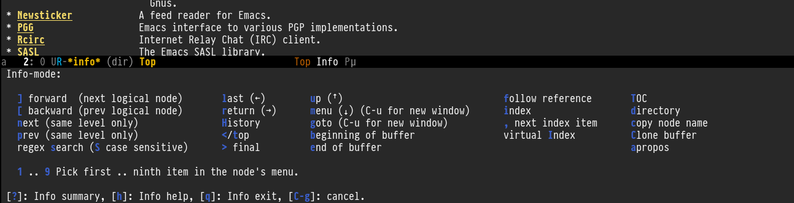

# Intro
The below `hydra-info` is written to replace the `Info-summary` buffer that is displayed when you hit <kbd>?</kbd> in any `Info-mode` buffer.

The best way to use this hydra would be to bind it, instead, to the <kbd>?</kbd> key in the `Info-mode-map`. *`Info-summary` can then be accessed by hitting <kbd>?</kbd> twice.*

``` emacs-lisp
(define-key Info-mode-map (kbd "?") #'hydra-info/body)
```

# `hydra-info`
``` emacs-lisp
(defhydra hydra-info (:color blue
                      :hint nil)
      "
Info-mode:

  ^^_]_ forward  (next logical node)       ^^_l_ast (←)        _u_p (↑)                             _f_ollow reference       _T_OC
  ^^_[_ backward (prev logical node)       ^^_r_eturn (→)      _m_enu (↓) (C-u for new window)      _i_ndex                  _d_irectory
  ^^_n_ext (same level only)               ^^_H_istory         _g_oto (C-u for new window)          _,_ next index item      _c_opy node name
  ^^_p_rev (same level only)               _<_/_t_op           _b_eginning of buffer                virtual _I_ndex          _C_lone buffer
  regex _s_earch (_S_ case sensitive)      ^^_>_ final         _e_nd of buffer                      ^^                       _a_propos

  _1_ .. _9_ Pick first .. ninth item in the node's menu.

"
      ("]"   Info-forward-node)
      ("["   Info-backward-node)
      ("n"   Info-next)
      ("p"   Info-prev)
      ("s"   Info-search)
      ("S"   Info-search-case-sensitively)

      ("l"   Info-history-back)
      ("r"   Info-history-forward)
      ("H"   Info-history)
      ("t"   Info-top-node)
      ("<"   Info-top-node)
      (">"   Info-final-node)

      ("u"   Info-up)
      ("^"   Info-up)
      ("m"   Info-menu)
      ("g"   Info-goto-node)
      ("b"   beginning-of-buffer)
      ("e"   end-of-buffer)

      ("f"   Info-follow-reference)
      ("i"   Info-index)
      (","   Info-index-next)
      ("I"   Info-virtual-index)

      ("T"   Info-toc)
      ("d"   Info-directory)
      ("c"   Info-copy-current-node-name)
      ("C"   clone-buffer)
      ("a"   info-apropos)

      ("1"   Info-nth-menu-item)
      ("2"   Info-nth-menu-item)
      ("3"   Info-nth-menu-item)
      ("4"   Info-nth-menu-item)
      ("5"   Info-nth-menu-item)
      ("6"   Info-nth-menu-item)
      ("7"   Info-nth-menu-item)
      ("8"   Info-nth-menu-item)
      ("9"   Info-nth-menu-item)

      ("?"   Info-summary "Info summary")
      ("h"   Info-help "Info help")
      ("q"   Info-exit "Info exit")
      ("C-g" nil "cancel" :color blue))
```

# Preview


# `hydra-info` revised
I copied and updated from above.
I also change some key bindings so the default info behaves like the hydra.
``` emacs-lisp
(define-key Info-mode-map (kbd "h") 'Info-backward-node)    ;; h was Info-help, Info-backward-node was [
(define-key Info-mode-map (kbd "l") 'Info-forward-node)     ;; l was Info-history-back, Info-forward-node was ]
(define-key Info-mode-map (kbd "y") 'Info-help)             ;; y wasn't bound, Info-help was h
(define-key Info-mode-map (kbd "K") 'Info-history)          ;; K wasn't bound, Info-history was L
(define-key Info-mode-map (kbd "H") 'Info-history-back)     ;; H was describe-mode, Info-history-back was l
(define-key Info-mode-map (kbd "L") 'Info-history-forward)  ;; L was Info-history, Info-history-forward was r
(define-key Info-mode-map (kbd "k") 'Info-up)               ;; k wasn't bound, Info-up was ^ and u
(define-key Info-mode-map (kbd "j") 'Info-menu)             ;; j was bmkp-info-jump, Info-menu was m
(define-key Info-mode-map (kbd "b") 'bmkp-info-jump)        ;; b was beginning-of-buffer, bmkp-info-jump was j

(defhydra hydra-info (:color pink
                      :hint nil)
  "
Info-mode:
_I_ndex(virtual)    _T_OC                            ^ ^^ ^  ^ ^ ^^     _k_/_u_p   ( )
_i_ndex             _t_op node        Node           _[__h_ + _l__]_      _j_/_m_enu ( ) (C-u for new window)
_c_opy node name    _a_propos         Top/Final Node _<__t_   ^ ^_>_      _g_oto node^^    (C-u for new window)
_C_lone buffer      _f_ollow          Level nxt/prev _p_^ ^   ^ ^_n_
_d_irectory         _b_mkp-jump       History        _H_^ ^   ^ ^_L_      _K_ History^^

_s_earch regex (_S_ case sens) ^^^^   _1_ .. _9_ Pick first .. ninth item in the node's menu.
"
  ("j"   Info-menu)              ;; m
  ("k"   Info-up)                ;; ^
  ("m"   Info-menu)
  ("u"   Info-up)

  ("l"   Info-forward-node)
  ("h"   Info-backward-node)
  ("]"   Info-forward-node)
  ("["   Info-backward-node)

  ("t"   Info-top-node)
  ("<"   Info-top-node)
  (">"   Info-final-node)

  ("n"   Info-next)
  ("p"   Info-prev)

  ("K"   Info-history)
  ("H"   Info-history-back)
  ("L"   Info-history-forward)

  ("s"   Info-search)
  ("S"   Info-search-case-sensitively)

  ("g"   Info-goto-node)

  ("f"   Info-follow-reference)
  ("b"   bmkp-info-jump)
  ("i"   Info-index)
  (","   Info-index-next)
  ("I"   Info-virtual-index)

  ("T"   Info-toc)
  ("t"   Info-top-node)
  ("d"   Info-directory)
  ("c"   Info-copy-current-node-name)
  ("C"   clone-buffer)
  ("a"   info-apropos)

  ("1"   Info-nth-menu-item)
  ("2"   Info-nth-menu-item)
  ("3"   Info-nth-menu-item)
  ("4"   Info-nth-menu-item)
  ("5"   Info-nth-menu-item)
  ("6"   Info-nth-menu-item)
  ("7"   Info-nth-menu-item)
  ("8"   Info-nth-menu-item)
  ("9"   Info-nth-menu-item)

  ("?"   Info-summary "Info summary")
  ("y"   Info-help "Info help")
  ("q"   Info-exit "Info exit" :color blue)
  ("C-g" nil "cancel" :color blue))
```

